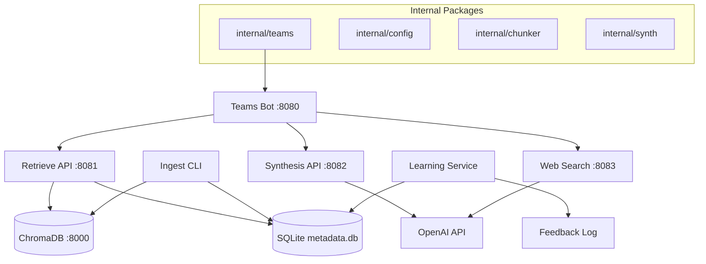

# AI-Powered Cloud SA Assistant

[](https://golang.org/doc/devel/release.html#go1.23)
[](LICENSE)
[]()
[]()

A demo-level AI assistant designed to accelerate pre-sales research for Solutions Architects. Built with Go microservices and powered by OpenAI, ChromaDB, and Microsoft Teams integration.

## 🌟 Project Philosophy

The AI-Powered Cloud SA Assistant is an internal, demo-level solution designed to showcase the power of modern RAG (Retrieval-Augmented Generation) architectures. Our mission is to transform the pre-sales workflow for Solutions Architects by turning hours of manual research into seconds of actionable, trusted, and visually impressive plans.

**Key Capabilities:**
- **Hybrid Retrieval Engine**: Combines metadata filtering, vector search, and live web search fallback.
- **On-Demand Plan Generation**: Generates comprehensive migration and architecture plans in seconds.
- **Automated Architecture Diagramming**: Generates Mermaid.js diagrams on the fly.
- **Actionable Code Scaffolding**: Delivers ready-to-use Terraform and CLI code snippets.
- **Seamless Teams Integration**: Interactive Adaptive Cards directly in Microsoft Teams.

## 🏗️ Architecture

The system is built as a set of modular Go microservices orchestrated via Docker Compose.



### Microservices Overview

- **Ingestion Service** (`cmd/ingest`): Parses documents, generates embeddings, and loads them into ChromaDB.
- **Retrieval API** (`cmd/retrieve`): Hybrid search (metadata + vector) with fallback logic.
- **Web Search Service** (`cmd/websearch`): Fetches live information based on freshness keywords.
- **Synthesis Service** (`cmd/synthesize`): LLM-powered response generation with diagrams and code.
- **Teams Bot** (`cmd/teamsbot`): Microsoft Teams interface with Adaptive Cards.
- **Learning Service** (`cmd/learning`): Background service that analyzes user feedback to improve system performance.

## 🚀 Quick Start

### Prerequisites

- Go 1.23.5
- Docker & Docker Compose
- OpenAI API key
- Microsoft Teams webhook URL (optional for local testing)

### Setup

1.  **Configure environment variables:**

    ```bash
    # Required: OpenAI API key
    export OPENAI_API_KEY="sk-..."

    # Optional: Teams webhook URL
    export TEAMS_WEBHOOK_URL="https://your-tenant.webhook.office.com/webhookb2/..."
    ```

2.  **Launch services:**

    ```bash
    make start-services
    # OR
    docker-compose up -d
    ```

3.  **Ingest demo data:**

    ```bash
    docker-compose run --rm ingest --docs-path=/app/docs
    ```

4.  **Verify Status:**

    ```bash
    make status
    ```

## 🎯 Demo Scenarios

### 1. AWS Lift-and-Shift Migration
**Prompt:** `@SA-Assistant Generate a high-level lift-and-shift plan for migrating 120 on-prem Windows and Linux VMs to AWS...`
**Output:** Comprehensive plan with AWS MGN architecture diagram, instance sizing recommendations, and AWS CLI commands.

### 2. Azure Hybrid Architecture Extension
**Prompt:** `@SA-Assistant Outline a hybrid reference architecture connecting our on-prem VMware environment to Azure...`
**Output:** ExpressRoute configuration guide, VMware HCX workflow diagram, and PowerShell scripts.

### 3. Azure Disaster Recovery as a Service
**Prompt:** `@SA-Assistant Design a DR solution in Azure for critical workloads with RTO = 2 hours and RPO = 15 minutes...`
**Output:** DR architecture diagram, Azure Site Recovery configuration, and cost optimization recommendations.

### 4. Security Compliance Assessment
**Prompt:** `@SA-Assistant Summarize HIPAA and GDPR encryption, logging, and policy enforcement requirements...`
**Output:** Executive-friendly compliance checklist, encryption standards table, and recent AWS compliance updates.

## ⚙️ Configuration

Configuration is managed via `configs/config.yaml` and environment variables. Environment variables take precedence.

```yaml
openai:
  apikey: "sk-..."
teams:
  webhook_url: "https://..."
services:
  retrieve_url: "http://retrieve:8080"
  websearch_url: "http://websearch:8080"
  synthesize_url: "http://synthesize:8080"
```

## 🧪 Development

### Running Tests

```bash
make test
```

### Code Quality

```bash
make check
```

## 🤝 Contributing

1.  Follow Go 1.23.5 standards.
2.  Run `make check` before PRs.
3.  Update documentation for new features.
4.  Maintain ≥80% test coverage.

## 📄 License

This project is licensed under the Apache 2.0 License - see the [LICENSE](LICENSE) file for details.
