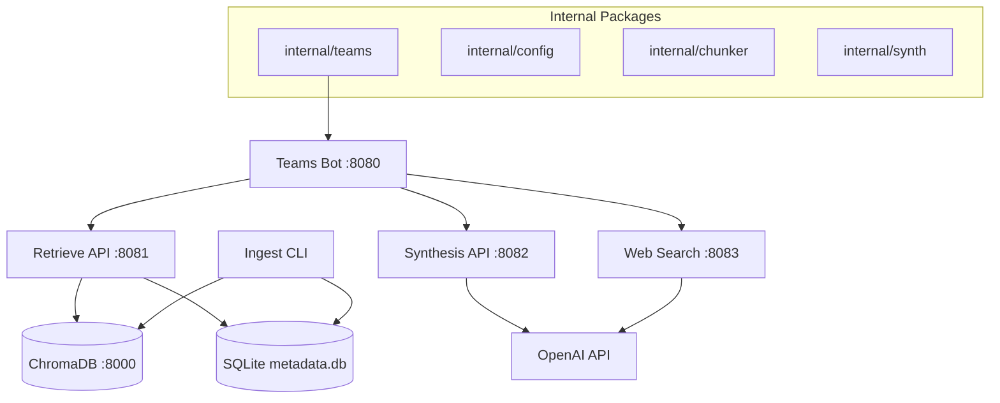

# AI-Powered Cloud SA Assistant

A demo-level AI assistant designed to accelerate pre-sales research for Solutions Architects. Built with Go microservices and powered by OpenAI, ChromaDB, and Microsoft Teams integration.

## 🚀 Quick Start

### Prerequisites
- Go 1.23.5
- Docker & Docker Compose
- OpenAI API key
- Microsoft Teams webhook URL

### Setup

1. **Clone and configure:**
   ```bash
   cp configs/config.template.yaml configs/config.yaml
   # Edit config.yaml with your API keys
   ```

2. **Launch services:**
   ```bash
   docker-compose up --build
   ```

3. **Ingest demo data:**
   ```bash
   docker-compose run --rm ingest --docs-path=/app/docs
   ```

4. **Test in Teams:**
   Send a message to your configured Teams channel!

## 🏗️ Architecture

### Microservices Overview

- **Ingestion Service** (`cmd/ingest`): Parses documents, generates embeddings, loads into ChromaDB
- **Retrieval API** (`cmd/retrieve`): Hybrid search (metadata + vector) with fallback logic
- **Web Search Service** (`cmd/websearch`): Fetches live information based on freshness keywords
- **Synthesis Service** (`cmd/synthesize`): LLM-powered response generation with diagrams and code
- **Teams Bot** (`cmd/teamsbot`): Microsoft Teams interface with Adaptive Cards

### Technology Stack

- **Runtime**: Go 1.23.5
- **Vector Store**: ChromaDB
- **Metadata**: SQLite
- **LLM**: OpenAI GPT-4o
- **Orchestration**: Docker Compose
- **UI**: Microsoft Teams Adaptive Cards

### Port Configuration

| Service | Internal | External |
|---------|----------|----------|
| ChromaDB | 8000 | 8000 |
| Retrieve | 8080 | 8081 |
| Synthesize | 8080 | 8082 |
| WebSearch | 8080 | 8083 |
| TeamsBot | 8080 | 8080 |

## 🎯 Demo Scenarios

### 1. AWS Lift-and-Shift Migration
```
@SA-Assistant Generate a high-level lift-and-shift plan for migrating 120 on-prem Windows and Linux VMs to AWS, including EC2 instance recommendations, VPC/subnet topology, and the latest AWS MGN best practices from Q2 2025.
```

**Expected Output**: Comprehensive plan with AWS MGN architecture diagram, instance sizing recommendations, VPC topology, and AWS CLI commands.

**Showcases**: Metadata filtering (migration + aws), chunk retrieval (EC2 sizing), web search (Q2 2025 MGN updates), synthesis with diagrams.

### 2. Azure Hybrid Architecture Extension
```
@SA-Assistant Outline a hybrid reference architecture connecting our on-prem VMware environment to Azure, covering ExpressRoute configuration, VMware HCX migration, active-active failover, and June 2025 Azure Hybrid announcements.
```

**Expected Output**: ExpressRoute configuration guide, VMware HCX workflow diagram, network topology, and PowerShell scripts.

**Showcases**: Metadata filtering (hybrid + azure), parallel retrieval (VMware docs + Azure docs), web search (June 2025 announcements), technical synthesis.

### 3. Azure Disaster Recovery as a Service
```
@SA-Assistant Design a DR solution in Azure for critical workloads with RTO = 2 hours and RPO = 15 minutes, including geo-replication options, failover orchestration, and cost-optimized standby.
```

**Expected Output**: DR architecture diagram, Azure Site Recovery configuration, RTO/RPO analysis, and cost optimization recommendations.

**Showcases**: Metadata filtering (disaster-recovery), fallback search (additional DR details), synthesis with technical specifications and cost analysis.

### 4. Security Compliance Assessment
```
@SA-Assistant Summarize HIPAA and GDPR encryption, logging, and policy enforcement requirements for our AWS landing zone, and include any recent AWS compliance feature updates.
```

**Expected Output**: Executive-friendly compliance checklist, encryption standards table, logging architecture, and recent AWS compliance updates.

**Showcases**: Metadata filtering (security + compliance), chunk retrieval (HIPAA/GDPR requirements), web search (recent updates), synthesis into actionable checklist.

## ⚙️ Configuration

### Environment Variables (Override config.yaml)
```bash
OPENAI_API_KEY=sk-...
TEAMS_WEBHOOK_URL=https://your-org.webhook.office.com/...
CONFIG_PATH=/path/to/config.yaml
```

### Configuration File Structure
```yaml
openai:
  apikey: "sk-..."
teams:
  webhook_url: "https://..."
services:
  retrieve_url: "http://retrieve:8080"
  websearch_url: "http://websearch:8080"
  synthesize_url: "http://synthesize:8080"
# ... see configs/config.template.yaml for full options
```

## 🧪 Development

### Running Tests
```bash
go test ./...
```

### Code Quality
```bash
golangci-lint run
go fmt ./...
go mod tidy
```

### Pre-commit Hooks
```bash
pre-commit install
pre-commit run --all-files
```

## 🔧 Key Features

### Hybrid Retrieval Pipeline
1. **Metadata Filtering**: SQLite-based document filtering by scenario/cloud/tags
2. **Vector Search**: Semantic search via ChromaDB embeddings
3. **Fallback Logic**: Automatic retry with broader search if results are insufficient
4. **Live Web Search**: Conditional web search for fresh information

### Intelligent Synthesis
- **Multi-modal Output**: Text + Mermaid diagrams + code snippets
- **Source Citations**: Automatic citation extraction and validation
- **Context-aware Prompting**: Structured prompts with internal docs and web results

### Teams Integration
- **Rich Adaptive Cards**: Professional formatting with images, code blocks, and sources
- **Feedback Mechanism**: 👍/👎 buttons for continuous improvement
- **Async Processing**: Non-blocking webhook handling

## 📊 Architecture Diagram



## 🛠️ Troubleshooting

### Common Issues

1. **ChromaDB Connection Failed**
   ```bash
   curl http://localhost:8000/api/v1/heartbeat
   ```

2. **OpenAI API Errors**
   - Check API key validity
   - Monitor rate limits
   - Review logs for 4xx errors

3. **Teams Card Not Rendering**
   - Validate JSON structure
   - Check webhook URL configuration
   - Review adaptive card schema

### Health Checks
```bash
# Service health
curl http://localhost:8081/health  # Retrieve
curl http://localhost:8082/health  # Synthesize
curl http://localhost:8083/health  # WebSearch
curl http://localhost:8080/health  # TeamsBot

# ChromaDB health
curl http://localhost:8000/api/v1/heartbeat
```

## 📈 Monitoring & Observability

- **Structured Logging**: JSON logs via Zap
- **Health Endpoints**: `/health` on all services
- **Feedback Tracking**: User feedback logged to `feedback.log`
- **Error Handling**: Graceful degradation with exponential backoff

## 🤝 Contributing

1. Follow Go 1.23.5 standards
2. Run tests and linting before PRs
3. Update documentation for new features
4. Maintain ≥80% test coverage

## 📄 License

This is a demo project for internal use.

---

**Version**: v1.0.0
**Last Updated**: 2025-01-01
