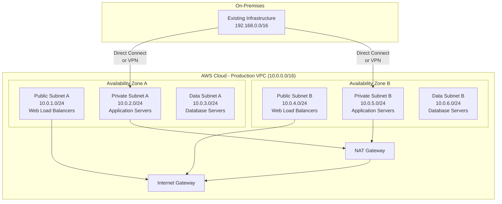

---
metadata:
  scenario: "migration"
  cloud: "aws"
  tags: ["lift-and-shift", "mgn", "ec2", "vpc", "replication"]
  difficulty: "intermediate"
  estimated_time: "4-12 weeks"
---

# AWS Lift and Shift Migration Guide

## Overview

This comprehensive guide provides a systematic approach to lift-and-shift migrations to AWS using AWS Application Migration Service (MGN). The strategy focuses on minimal application changes while maximizing cloud infrastructure benefits, including scalability, reliability, and cost optimization. This approach is ideal for organizations requiring rapid migration timelines with reduced risk exposure.

## Pre-Migration Assessment

### Infrastructure Discovery and Planning

**Automated Discovery Tools:**

```bash
# Install AWS Application Discovery Agent
wget https://s3.amazonaws.com/aws-application-discovery-agent/aws-application-discovery-agent.tar.gz
sudo ./install -r us-east-1 -k YOUR_ACCESS_KEY -s YOUR_SECRET_KEY
```

**Discovery Checklist:**

- Catalog all on-premises servers, applications, and dependencies
- Document current resource utilization (CPU, memory, storage, network)
- Identify operating system versions and software licensing requirements
- Map inter-application dependencies and data flows
- Assess network latency requirements between components
- Inventory database connections and shared storage dependencies

### AWS Landing Zone Setup

**Multi-Account Strategy:**

```bash
# Create AWS Organizations structure
aws organizations create-organization --feature-set ALL

# Create production account
aws organizations create-account --account-name "Production" --email "aws-prod@company.com"

# Create development account
aws organizations create-account --account-name "Development" --email "aws-dev@company.com"
```

**Core Networking Configuration:**

```bash
# Create VPC
aws ec2 create-vpc --cidr-block 10.0.0.0/16 --tag-specifications 'ResourceType=vpc,Tags=[{Key=Name,Value=Migration-VPC}]'

# Create Internet Gateway
aws ec2 create-internet-gateway --tag-specifications 'ResourceType=internet-gateway,Tags=[{Key=Name,Value=Migration-IGW}]'
```

## Migration Strategy

### AWS Application Migration Service (MGN) Implementation

**Phase 1: Agent Installation and Replication Setup**

```bash
# Download and install MGN agent (Linux)
wget -O ./aws-replication-installer-init.py https://aws-application-migration-service-us-east-1.s3.amazonaws.com/latest/linux/aws-replication-installer-init.py
sudo python3 aws-replication-installer-init.py --region us-east-1 --aws-access-key-id YOUR_KEY --aws-secret-access-key YOUR_SECRET

# Windows PowerShell installation
Invoke-WebRequest -Uri "https://aws-application-migration-service-us-east-1.s3.amazonaws.com/latest/windows/AwsReplicationInstaller.exe" -OutFile "AwsReplicationInstaller.exe"
.\AwsReplicationInstaller.exe --region us-east-1 --aws-access-key-id YOUR_KEY --aws-secret-access-key YOUR_SECRET
```

**Phase 2: Replication Configuration**

```bash
# Configure replication settings
aws mgn put-source-server-action \
  --source-server-id s-1234567890abcdef0 \
  --action-name "StopServices" \
  --document-json '{"actionName": "StopServices", "mustSucceedForCutover": true}'

# Set launch template configuration
aws mgn create-launch-configuration-template \
  --launch-template-name "WebServerTemplate" \
  --instance-type "t3.large" \
  --security-group-ids "sg-12345678" \
  --subnet-id "subnet-12345678"
```

**Phase 3: Test Launch and Validation**

```bash
# Start test instances
aws mgn start-test --source-server-ids s-1234567890abcdef0

# Monitor replication progress
aws mgn describe-source-servers --source-server-ids s-1234567890abcdef0
```

## Network Architecture Design

### VPC Design Patterns

**Production-Ready Multi-Tier Architecture:**



**CIDR Block Allocation Strategy:**

| Environment | VPC CIDR | Available IPs | Use Case |
|-------------|----------|---------------|----------|
| Production | 10.0.0.0/16 | 65,536 | Main production workloads |
| Development | 10.1.0.0/16 | 65,536 | Development and testing |
| Management | 10.2.0.0/16 | 65,536 | Shared services, monitoring |

### Subnet Design Best Practices

```bash
# Create production subnets
aws ec2 create-subnet --vpc-id vpc-12345678 --cidr-block 10.0.1.0/24 --availability-zone us-east-1a --tag-specifications 'ResourceType=subnet,Tags=[{Key=Name,Value=Web-Subnet-A},{Key=Tier,Value=Public}]'

aws ec2 create-subnet --vpc-id vpc-12345678 --cidr-block 10.0.2.0/24 --availability-zone us-east-1a --tag-specifications 'ResourceType=subnet,Tags=[{Key=Name,Value=App-Subnet-A},{Key=Tier,Value=Private}]'

aws ec2 create-subnet --vpc-id vpc-12345678 --cidr-block 10.0.3.0/24 --availability-zone us-east-1a --tag-specifications 'ResourceType=subnet,Tags=[{Key=Name,Value=Data-Subnet-A},{Key=Tier,Value=Private}]'
```

## Instance Sizing Decision Matrix

### Server Role-Based Sizing Recommendations

| Server Type | Current Config | AWS Instance Type | vCPU | Memory | Storage | Network Performance |
|-------------|---------------|------------------|------|--------|---------|-------------------|
| Web Server (Low Traffic) | 2 vCPU, 4GB RAM | t3.medium | 2 | 4 GiB | EBS-optimized | Up to 5 Gbps |
| Web Server (Medium Traffic) | 4 vCPU, 8GB RAM | t3.large | 2 | 8 GiB | EBS-optimized | Up to 5 Gbps |
| Web Server (High Traffic) | 8 vCPU, 16GB RAM | c5.2xlarge | 8 | 16 GiB | EBS-optimized | Up to 10 Gbps |
| Application Server | 4 vCPU, 16GB RAM | m5.xlarge | 4 | 16 GiB | EBS-optimized | Up to 10 Gbps |
| Database Server (OLTP) | 8 vCPU, 32GB RAM | r5.2xlarge | 8 | 64 GiB | EBS-optimized | Up to 10 Gbps |
| Database Server (OLAP) | 16 vCPU, 64GB RAM | r5.4xlarge | 16 | 128 GiB | EBS-optimized | Up to 10 Gbps |
| File Server | 4 vCPU, 8GB RAM | m5.large | 2 | 8 GiB | EBS-optimized | Up to 10 Gbps |
| Domain Controller | 2 vCPU, 4GB RAM | t3.medium | 2 | 4 GiB | EBS-optimized | Up to 5 Gbps |

### Instance Sizing Automation Script

```bash
#!/bin/bash
# Instance sizing recommendation script
get_instance_recommendation() {
    local cpu_cores=$1
    local memory_gb=$2
    local workload_type=$3

    case $workload_type in
        "web")
            if [ $cpu_cores -le 2 ] && [ $memory_gb -le 4 ]; then
                echo "t3.medium"
            elif [ $cpu_cores -le 4 ] && [ $memory_gb -le 8 ]; then
                echo "t3.large"
            else
                echo "c5.2xlarge"
            fi
            ;;
        "app")
            if [ $memory_gb -le 8 ]; then
                echo "m5.large"
            elif [ $memory_gb -le 16 ]; then
                echo "m5.xlarge"
            else
                echo "m5.2xlarge"
            fi
            ;;
        "database")
            if [ $memory_gb -le 16 ]; then
                echo "r5.large"
            elif [ $memory_gb -le 32 ]; then
                echo "r5.xlarge"
            else
                echo "r5.2xlarge"
            fi
            ;;
    esac
}

# Usage example
get_instance_recommendation 4 16 "app"
```

## Security and Compliance Implementation

### Security Group Configuration

```bash
# Web tier security group
aws ec2 create-security-group \
  --group-name WebTierSG \
  --description "Security group for web tier" \
  --vpc-id vpc-12345678

# Allow HTTP/HTTPS from internet
aws ec2 authorize-security-group-ingress \
  --group-id sg-web12345 \
  --protocol tcp \
  --port 80 \
  --cidr 0.0.0.0/0

aws ec2 authorize-security-group-ingress \
  --group-id sg-web12345 \
  --protocol tcp \
  --port 443 \
  --cidr 0.0.0.0/0

# Application tier security group
aws ec2 create-security-group \
  --group-name AppTierSG \
  --description "Security group for application tier" \
  --vpc-id vpc-12345678

# Allow traffic from web tier only
aws ec2 authorize-security-group-ingress \
  --group-id sg-app12345 \
  --protocol tcp \
  --port 8080 \
  --source-group sg-web12345
```

### Compliance and Encryption

```bash
# Enable EBS encryption by default
aws ec2 enable-ebs-encryption-by-default

# Create encrypted EBS volume
aws ec2 create-volume \
  --size 100 \
  --volume-type gp3 \
  --encrypted \
  --availability-zone us-east-1a \
  --tag-specifications 'ResourceType=volume,Tags=[{Key=Name,Value=EncryptedAppData}]'

# Enable CloudTrail for audit logging
aws cloudtrail create-trail \
  --name ComplianceTrail \
  --s3-bucket-name compliance-audit-logs \
  --include-global-service-events \
  --is-multi-region-trail \
  --enable-log-file-validation
```

## Cost Optimization Strategies

### Reserved Instance Strategy

```bash
# Analyze Reserved Instance recommendations
aws ce get-reserved-instances-purchase-recommendation \
  --service EC2-Instance \
  --account-scope PAYER \
  --lookback-period-in-days 30 \
  --term-in-years 1 \
  --payment-option NO_UPFRONT

# Purchase Reserved Instances
aws ec2 purchase-reserved-instances-offering \
  --reserved-instances-offering-id ri-1234567890abcdef0 \
  --instance-count 2
```

### Automated Cost Monitoring

```bash
# Create cost budget with alerts
aws budgets create-budget \
  --account-id 123456789012 \
  --budget '{
    "BudgetName": "Migration-Budget",
    "BudgetLimit": {
      "Amount": "5000",
      "Unit": "USD"
    },
    "TimeUnit": "MONTHLY",
    "BudgetType": "COST",
    "CostFilters": {
      "Service": ["Amazon Elastic Compute Cloud - Compute"]
    }
  }'
```

## Post-Migration Optimization

### Performance Monitoring Setup

```bash
# Enable detailed monitoring
aws ec2 monitor-instances --instance-ids i-1234567890abcdef0

# Create CloudWatch alarms
aws cloudwatch put-metric-alarm \
  --alarm-name CPU-Utilization-High \
  --alarm-description "Alarm when CPU exceeds 70%" \
  --metric-name CPUUtilization \
  --namespace AWS/EC2 \
  --statistic Average \
  --period 300 \
  --threshold 70 \
  --comparison-operator GreaterThanThreshold \
  --evaluation-periods 2
```

### Auto Scaling Configuration

```bash
# Create launch template
aws ec2 create-launch-template \
  --launch-template-name WebServerLT \
  --version-description "Initial version" \
  --launch-template-data '{
    "ImageId": "ami-12345678",
    "InstanceType": "t3.large",
    "SecurityGroupIds": ["sg-12345678"],
    "UserData": "IyEvYmluL2Jhc2gKc3VkbyB5dW0gdXBkYXRlIC15"
  }'

# Create Auto Scaling Group
aws autoscaling create-auto-scaling-group \
  --auto-scaling-group-name WebServerASG \
  --launch-template LaunchTemplateName=WebServerLT,Version=1 \
  --min-size 2 \
  --max-size 10 \
  --desired-capacity 4 \
  --vpc-zone-identifier "subnet-12345678,subnet-87654321"
```

## Troubleshooting Common Issues

### MGN Replication Issues

**Problem**: Replication agent fails to connect

```bash
# Check replication agent status
sudo systemctl status aws-replication-agent

# Check network connectivity
telnet mgn.us-east-1.amazonaws.com 443

# Verify IAM permissions
aws sts get-caller-identity
```

**Solution**: Ensure security groups allow outbound HTTPS traffic and IAM role has MGN permissions.

### Performance Issues

**Problem**: High CPU utilization after migration

```bash
# Check CloudWatch metrics
aws cloudwatch get-metric-statistics \
  --namespace AWS/EC2 \
  --metric-name CPUUtilization \
  --dimensions Name=InstanceId,Value=i-1234567890abcdef0 \
  --start-time 2023-01-01T00:00:00Z \
  --end-time 2023-01-02T00:00:00Z \
  --period 3600 \
  --statistics Average
```

**Solution**: Right-size instances based on actual workload patterns and enable auto-scaling.

### Connectivity Issues

**Problem**: Applications cannot connect to databases

```bash
# Test database connectivity
telnet database-server.internal 5432

# Check security group rules
aws ec2 describe-security-groups --group-ids sg-12345678
```

**Solution**: Verify security group rules allow required ports and protocols between tiers.

### License Activation Issues

**Problem**: Windows activation fails in AWS

```bash
# Check Windows activation status
slmgr /xpr

# Reactivate Windows
slmgr /ato
```

**Solution**: Ensure KMS activation is properly configured for AWS-provided Windows licenses.

## Conclusion

This comprehensive guide provides the foundation for successful AWS lift-and-shift migrations using MGN. Success depends on thorough planning, proper security implementation, and continuous optimization post-migration. Regular monitoring and cost optimization ensure long-term value realization from the cloud migration investment.
