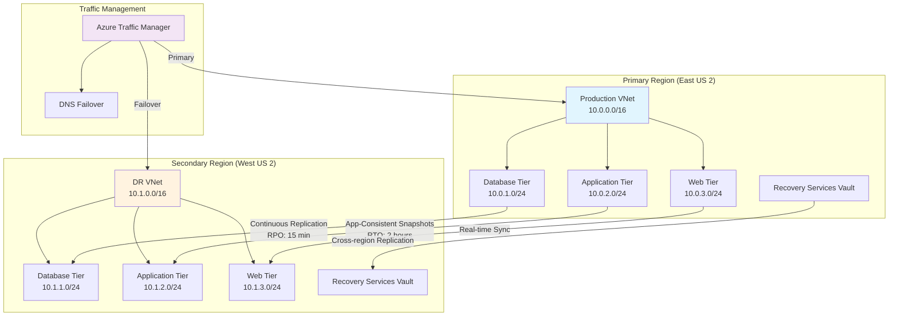

# Azure Disaster Recovery Solution Guide

## Overview

This guide provides comprehensive disaster recovery (DR) strategies for critical workloads using Microsoft Azure, focusing on achieving aggressive Recovery Time Objectives (RTO) and Recovery Point Objectives (RPO) while maintaining cost optimization.

## DR Requirements and SLA Design

### RTO/RPO Target Framework

#### Mission-Critical Workloads (RTO = 2 hours, RPO = 15 minutes)

- **Primary Use Cases**: Financial systems, e-commerce platforms, customer-facing applications
- **Technology Stack**: Azure Site Recovery with premium storage and express route connectivity
- **Replication Frequency**: Continuous replication with 15-minute consistency points
- **Failover Automation**: Automated failover with minimal manual intervention

#### Business-Critical Workloads (RTO = 4 hours, RPO = 1 hour)

- **Primary Use Cases**: ERP systems, CRM platforms, internal business applications
- **Technology Stack**: Azure Site Recovery with standard storage and scheduled replication
- **Replication Frequency**: Hourly replication with application-consistent snapshots
- **Failover Process**: Semi-automated failover with validation checkpoints

#### Standard Workloads (RTO = 24 hours, RPO = 4 hours)

- **Primary Use Cases**: Development environments, reporting systems, archival applications
- **Technology Stack**: Azure Backup with cross-region restore capabilities
- **Replication Frequency**: Daily backups with incremental changes
- **Failover Process**: Manual failover with standard recovery procedures

## Azure Site Recovery Architecture

### Mermaid DR Architecture Diagram



### Core Components

#### Site Recovery Vault

- **Purpose**: Centralized management and orchestration of DR operations
- **Configuration**: Multi-region deployment for vault redundancy
- **Security**: Customer-managed encryption keys for data protection
- **Monitoring**: Integrated Azure Monitor for health and performance tracking
- **PowerShell Setup**:

```powershell
# Create Recovery Services Vault
New-AzRecoveryServicesVault -ResourceGroupName "RG-ASR-Primary" -Name "ASR-Vault-EastUS2" -Location "East US 2"

# Configure vault redundancy
Set-AzRecoveryServicesVaultBackupProperty -Vault $vault -BackupStorageRedundancy LocallyRedundant
```

#### Replication Infrastructure

- **Process Servers**: Handle replication traffic and caching for optimal performance
- **Configuration Servers**: Manage replication policies and coordinate recovery
- **Master Target Servers**: Receive and store replicated data in the recovery region
- **Mobility Service**: Agent-based replication for physical and virtual machines

### Geo-Replication Strategy

#### Primary to Secondary Region Mapping

```text
Primary Region (East US 2)          Secondary Region (West US 2)
├── Production VNet: 10.0.0.0/16    ├── DR VNet: 10.1.0.0/16
├── Database Tier: 10.0.1.0/24      ├── Database Tier: 10.1.1.0/24
├── Application Tier: 10.0.2.0/24   ├── Application Tier: 10.1.2.0/24
└── Web Tier: 10.0.3.0/24           └── Web Tier: 10.1.3.0/24
```

#### Network Configuration

- **Virtual Network Pairing**: Establish VNet peering for seamless connectivity
- **DNS Configuration**: Implement DNS failover with Azure Traffic Manager
- **Load Balancer Setup**: Configure cross-region load balancing for active-passive scenarios
- **Firewall Rules**: Replicate security groups and network ACLs to maintain security posture

## Storage and Data Protection

### Premium Storage Configuration for RTO=2h, RPO=15min

- **Use Case**: Sub-15-minute RPO requirements for mission-critical workloads
- **Performance**: High IOPS and low latency for real-time replication
- **Redundancy**: Zone-redundant storage (ZRS) for maximum availability
- **Backup Integration**: Combined with Azure Backup for multi-layered protection

```powershell
# Configure premium storage for critical workloads
$storageAccount = New-AzStorageAccount -ResourceGroupName "RG-ASR-Primary" `
    -Name "asrpremiumstorage001" `
    -Location "East US 2" `
    -SkuName "Premium_LRS" `
    -Kind "StorageV2" `
    -EnableHttpsTrafficOnly $true

# Enable soft delete for additional protection
Enable-AzStorageDeleteRetentionPolicy -ResourceGroupName "RG-ASR-Primary" `
    -StorageAccountName "asrpremiumstorage001" `
    -RetentionDays 30
```

### Standard Storage Optimization

- **Use Case**: Cost-effective protection for business-critical workloads
- **Tiering**: Automated tiering between hot, cool, and archive storage
- **Compression**: Built-in compression to reduce storage costs and replication time
- **Lifecycle Management**: Automated data lifecycle policies for long-term retention

```powershell
# Configure lifecycle management for cost optimization
$ctx = (Get-AzStorageAccount -ResourceGroupName "RG-ASR-Primary" -Name "asrstandardstorage001").Context

# Create lifecycle policy
$rule = New-AzStorageAccountManagementPolicyRule -Name "DrDataLifecycle" `
    -Enabled $true `
    -Definition (New-AzStorageAccountManagementPolicyRuleDefinition `
        -BlobType blockBlob `
        -Actions (New-AzStorageAccountManagementPolicyRuleAction `
            -TierToCoolAfterDaysGreaterThan 30 `
            -TierToArchiveAfterDaysGreaterThan 90 `
            -DeleteAfterDaysGreaterThan 2555))

Set-AzStorageAccountManagementPolicy -ResourceGroupName "RG-ASR-Primary" `
    -StorageAccountName "asrstandardstorage001" `
    -Rule $rule
```

### Database-Specific Protection

#### SQL Server Always On Availability Groups

- **Configuration**: Multi-region availability groups with automatic failover
- **Backup Strategy**: Integrated with Azure SQL Database backup and restore
- **Monitoring**: SQL Insights for performance and health monitoring
- **Recovery**: Point-in-time recovery capabilities for data corruption scenarios

#### Oracle Data Guard

- **Setup**: Primary and standby databases across Azure regions
- **Synchronization**: Real-time redo log shipping for minimal data loss
- **Failover Types**: Automatic and manual failover options based on scenario
- **Integration**: Combined with Azure Site Recovery for complete VM protection

## Failover Orchestration and Automation

### Recovery Plans

- **Multi-Tier Applications**: Coordinated startup sequence for application dependencies
- **Network Reconfiguration**: Automated IP address management and DNS updates
- **Load Balancer Updates**: Dynamic backend pool updates during failover
- **Monitoring Integration**: Real-time status updates and notification systems

### PowerShell Failover Automation Scripts

#### Automated Failover Orchestration

```powershell
# PowerShell script for automated failover with RTO=2 hours, RPO=15 minutes

# Set vault context
$vault = Get-AzRecoveryServicesVault -ResourceGroupName "RG-ASR-Primary" -Name "ASR-Vault-EastUS2"
Set-AzRecoveryServicesAsrVaultContext -Vault $vault

# Get recovery plan
$recoveryPlan = Get-AzRecoveryServicesAsrRecoveryPlan -Name "Production-App-DR-Plan"

# Initiate planned failover
Start-AzRecoveryServicesAsrPlannedFailoverJob -RecoveryPlan $recoveryPlan -Direction PrimaryToRecovery

# Monitor failover progress
do {
    $job = Get-AzRecoveryServicesAsrJob -Job $failoverJob
    Write-Host "Failover Status: $($job.State) - $($job.StateDescription)"
    Start-Sleep -Seconds 30
} while ($job.State -eq "InProgress")

# Update Traffic Manager after successful failover
if ($job.State -eq "Succeeded") {
    # Disable primary endpoint
    Disable-AzTrafficManagerEndpoint -Name "Primary-Endpoint" -Type AzureEndpoints -ProfileName "Production-TM-Profile" -ResourceGroupName "RG-TrafficManager"

    # Enable secondary endpoint
    Enable-AzTrafficManagerEndpoint -Name "Secondary-Endpoint" -Type AzureEndpoints -ProfileName "Production-TM-Profile" -ResourceGroupName "RG-TrafficManager"

    Write-Host "Failover completed successfully. RTO target of 2 hours achieved."
}
```

#### RTO/RPO Calculation Methodology

```powershell
# PowerShell script to calculate and monitor RTO/RPO metrics

# Function to calculate RPO (Recovery Point Objective)
function Get-RPOMetrics {
    param(
        [string]$VaultName,
        [string]$ResourceGroupName
    )

    $vault = Get-AzRecoveryServicesVault -ResourceGroupName $ResourceGroupName -Name $VaultName
    Set-AzRecoveryServicesAsrVaultContext -Vault $vault

    $replicationItems = Get-AzRecoveryServicesAsrReplicationProtectedItem

    foreach ($item in $replicationItems) {
        $lastReplication = $item.LastReplicationTime
        $currentTime = Get-Date
        $rpoMinutes = ($currentTime - $lastReplication).TotalMinutes

        Write-Host "VM: $($item.FriendlyName) - RPO: $rpoMinutes minutes"

        # Alert if RPO exceeds 15 minutes
        if ($rpoMinutes -gt 15) {
            Write-Warning "RPO threshold exceeded for $($item.FriendlyName): $rpoMinutes minutes"
        }
    }
}

# Function to calculate RTO (Recovery Time Objective)
function Get-RTOMetrics {
    param(
        [string]$RecoveryPlanName
    )

    $recoveryPlan = Get-AzRecoveryServicesAsrRecoveryPlan -Name $RecoveryPlanName
    $jobs = Get-AzRecoveryServicesAsrJob | Where-Object { $_.TargetObjectName -eq $RecoveryPlanName }

    foreach ($job in $jobs) {
        if ($job.JobType -eq "PlannedFailover") {
            $duration = ($job.EndTime - $job.StartTime).TotalHours
            Write-Host "Failover Duration: $duration hours"

            # Alert if RTO exceeds 2 hours
            if ($duration -gt 2) {
                Write-Warning "RTO threshold exceeded: $duration hours"
            }
        }
    }
}

# Monitor RPO every 15 minutes
Get-RPOMetrics -VaultName "ASR-Vault-EastUS2" -ResourceGroupName "RG-ASR-Primary"
```

#### Azure CLI Commands for Site Recovery

```bash
# Create Site Recovery configuration
az backup vault create --resource-group "RG-ASR-Primary" --name "ASR-Vault-EastUS2" --location "eastus2"

# Enable replication for a VM
az site-recovery replication-protected-item create \
    --resource-group "RG-ASR-Primary" \
    --vault-name "ASR-Vault-EastUS2" \
    --source-vm-id "/subscriptions/{subscription-id}/resourceGroups/RG-Production/providers/Microsoft.Compute/virtualMachines/WebServer-01" \
    --target-resource-group "RG-DR-WestUS2" \
    --target-location "westus2"

# Create recovery plan
az site-recovery recovery-plan create \
    --resource-group "RG-ASR-Primary" \
    --vault-name "ASR-Vault-EastUS2" \
    --name "Production-App-DR-Plan" \
    --source-fabric-id "fabric-eastus2" \
    --target-fabric-id "fabric-westus2"
```

### Testing and Validation

- **Non-Disruptive Testing**: Regular DR drills without impacting production systems
- **Test Automation**: Scripted test scenarios for consistent validation
- **Performance Benchmarking**: Comparison of DR environment performance against production
- **Documentation Updates**: Automated updates to runbooks and procedures

### Failback Procedures

- **Health Validation**: Comprehensive checks before initiating failback
- **Incremental Sync**: Efficient synchronization of changes during DR period
- **Cutover Coordination**: Scheduled maintenance windows for planned failback
- **Rollback Capabilities**: Quick rollback to DR environment if issues arise

## Cost-Optimized Standby Solutions

### Cold Standby Architecture

- **Resource Allocation**: Minimal compute resources with on-demand scaling
- **Storage Optimization**: Archive-tier storage for long-term data retention
- **Automation**: Infrastructure as Code (IaC) for rapid environment provisioning
- **Cost Monitoring**: Regular cost analysis and optimization recommendations

### Warm Standby Configuration

- **Partial Resource Deployment**: Scaled-down versions of production resources
- **Data Synchronization**: Continuous replication with reduced compute overhead
- **Auto-scaling Policies**: Automatic scaling during failover activation
- **Performance Tuning**: Optimized for rapid scale-up when needed

### Hot Standby Implementation

- **Full Resource Mirroring**: Complete infrastructure replication for instant failover
- **Active Monitoring**: Real-time health checks and performance monitoring
- **Load Distribution**: Traffic splitting for active-active configurations
- **Cost Justification**: ROI analysis for mission-critical workload protection

## Compliance and Governance

### Regulatory Requirements

- **Data Residency**: Ensure data remains within required geographic boundaries
- **Encryption Standards**: Implement required encryption at rest and in transit
- **Audit Trails**: Comprehensive logging for compliance reporting
- **Access Controls**: Role-based access with principle of least privilege

### Risk Management

- **Business Impact Analysis**: Quantified impact of various failure scenarios
- **Risk Assessment Matrix**: Probability and impact analysis for DR planning
- **Mitigation Strategies**: Proactive measures to reduce risk exposure
- **Insurance Considerations**: Cyber insurance alignment with DR capabilities

## Monitoring and Alerting

### Health Monitoring

- **Replication Health**: Continuous monitoring of replication status and performance
- **Infrastructure Health**: VM, storage, and network component monitoring
- **Application Health**: End-to-end application performance and availability
- **Security Monitoring**: Threat detection and security event correlation

### Alert Configuration

- **Escalation Procedures**: Tiered alerting based on severity and impact
- **Notification Channels**: Multi-channel notifications including email, SMS, and webhooks
- **Dashboard Integration**: Real-time dashboards for operations teams
- **Automated Responses**: Self-healing capabilities for common failure scenarios

## Recovery Validation and Testing

### Test Scenarios

- **Component Failure**: Individual service or infrastructure component failures
- **Regional Outage**: Complete primary region unavailability
- **Cyber Attack**: Security incident requiring isolation and recovery
- **Data Corruption**: Database or file system corruption scenarios

### Success Criteria

- **RTO Achievement**: Measured time from failure detection to service restoration
- **RPO Validation**: Data loss assessment and recovery point accuracy
- **Functionality Testing**: Complete application functionality verification
- **Performance Baseline**: Comparison against production performance metrics

### Continuous Improvement

- **Lessons Learned**: Post-incident analysis and improvement recommendations
- **Process Optimization**: Streamlining recovery procedures based on test results
- **Technology Updates**: Regular assessment of new DR technologies and capabilities
- **Training Programs**: Ongoing training for operations and incident response teams
