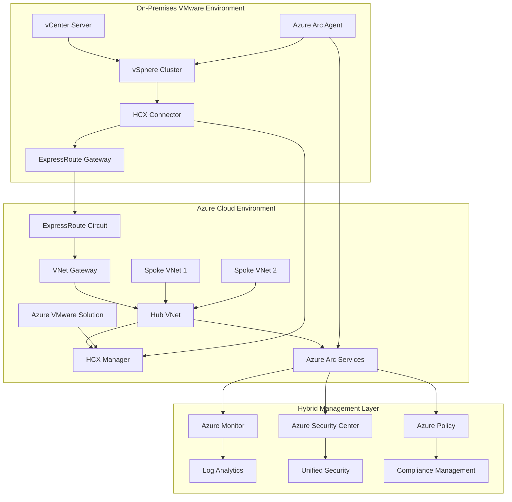
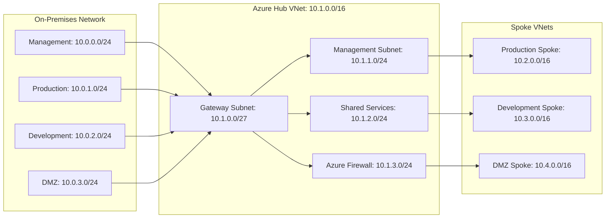
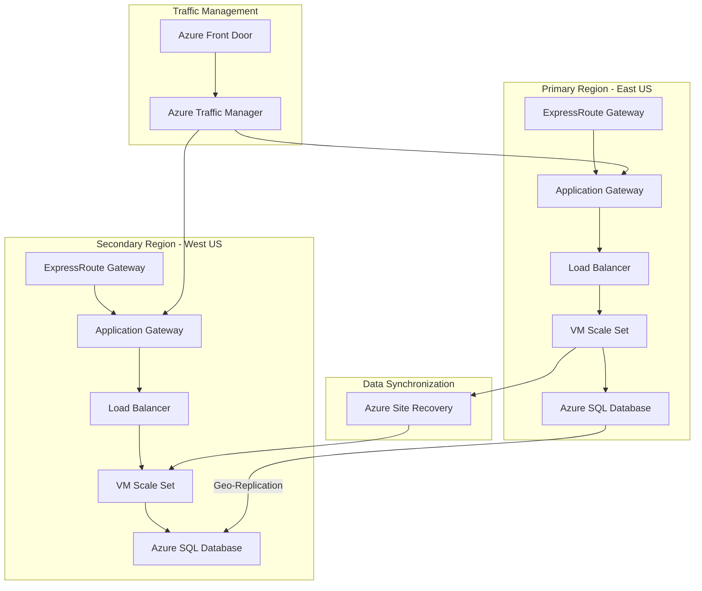

# Azure Hybrid Architecture Guide: ExpressRoute & VMware HCX Integration

## Executive Summary

This comprehensive guide provides Solutions Architects with a detailed approach to designing and implementing hybrid cloud architectures that seamlessly connect on-premises VMware environments to Microsoft Azure. The architecture leverages ExpressRoute for reliable, high-performance connectivity and VMware HCX for sophisticated workload migration capabilities, enhanced with Azure Arc for unified hybrid management.

## Architecture Overview



## ExpressRoute Configuration Deep Dive

### Circuit Planning and Provisioning

ExpressRoute provides dedicated, high-bandwidth connectivity between on-premises infrastructure and Azure, offering predictable performance and enhanced security compared to internet-based connections.

#### Circuit Configuration Commands

```powershell
# Create ExpressRoute circuit
$circuit = New-AzExpressRouteCircuit -Name "HybridER-Circuit" `
    -ResourceGroupName "hybrid-connectivity-rg" `
    -Location "East US" `
    -SkuTier "Standard" `
    -SkuFamily "MeteredData" `
    -ServiceProviderName "Equinix" `
    -PeeringLocation "Washington DC" `
    -BandwidthInMbps 1000

# Configure private peering
$peering = New-AzExpressRouteCircuitPeeringConfig -Name "AzurePrivatePeering" `
    -PeeringType "AzurePrivatePeering" `
    -PeerASN 65000 `
    -PrimaryPeerAddressPrefix "10.0.0.0/30" `
    -SecondaryPeerAddressPrefix "10.0.0.4/30" `
    -VlanId 200

Add-AzExpressRouteCircuitPeeringConfig -ExpressRouteCircuit $circuit -PeeringConfig $peering
Set-AzExpressRouteCircuit -ExpressRouteCircuit $circuit
```

#### Gateway Configuration for Hub-and-Spoke

```bash
# Create VNet gateway subnet
az network vnet subnet create \
    --resource-group hybrid-connectivity-rg \
    --vnet-name hub-vnet \
    --name GatewaySubnet \
    --address-prefixes 10.1.0.0/27

# Create ExpressRoute gateway
az network vnet-gateway create \
    --resource-group hybrid-connectivity-rg \
    --name hybrid-er-gateway \
    --public-ip-address er-gateway-pip \
    --vnet hub-vnet \
    --gateway-type ExpressRoute \
    --sku Standard \
    --vpn-type RouteBased \
    --location eastus
```

### Network Topology Design



## VMware HCX Deployment and Configuration

### HCX Components Architecture

VMware HCX provides seamless workload mobility, network extension, and migration capabilities between on-premises VMware environments and Azure VMware Solution.

#### HCX Manager Deployment

```powershell
# Deploy HCX Manager in Azure VMware Solution
$hcxConfig = @{
    SubscriptionId = "your-subscription-id"
    ResourceGroupName = "avs-hybrid-rg"
    PrivateCloudName = "avs-private-cloud"
    AddonName = "hcx"
    AddonType = "HCX"
}

New-AzVMwareAddon @hcxConfig
```

#### HCX Connector Configuration

```bash
# Configure HCX site pairing
az vmware hcx-site-pair create \
    --resource-group avs-hybrid-rg \
    --private-cloud avs-private-cloud \
    --site-pair-name "on-premises-to-azure" \
    --remote-site-url "https://hcx-manager.corp.local" \
    --local-site-url "https://hcx-manager.avs.azure.com"
```

### Migration Workflows and Patterns

#### Bulk Migration Strategy

```powershell
# PowerShell script for bulk migration planning
$migrationPlan = @{
    SourceVMs = Get-VM -Location "On-Premises-Cluster"
    TargetCluster = "Azure-VMware-Solution-Cluster"
    MigrationWindow = "2025-01-15T02:00:00Z"
    NetworkExtension = $true
    ValidationChecks = $true
}

Start-HCXBulkMigration @migrationPlan
```

#### vMotion Migration Configuration

```bash
# Configure network extension for vMotion
az vmware hcx network-extension create \
    --resource-group avs-hybrid-rg \
    --private-cloud avs-private-cloud \
    --network-name "production-network" \
    --source-network "10.0.1.0/24" \
    --extension-appliance "hcx-ne-appliance"
```

## Active-Active Failover Architecture

### Multi-Region Failover Design



### Failover Automation Script

```powershell
# Automated failover script
function Invoke-HybridFailover {
    param(
        [string]$PrimaryRegion = "East US",
        [string]$SecondaryRegion = "West US",
        [string]$ResourceGroupName = "hybrid-failover-rg"
    )

    # Health check primary region
    $primaryHealth = Test-AzResourceHealth -ResourceGroupName $ResourceGroupName -Region $PrimaryRegion

    if ($primaryHealth.Status -eq "Unavailable") {
        Write-Output "Primary region unhealthy. Initiating failover..."

        # Update Traffic Manager endpoint
        Set-AzTrafficManagerEndpoint -Name "primary-endpoint" -ProfileName "hybrid-profile" -Status "Disabled"
        Set-AzTrafficManagerEndpoint -Name "secondary-endpoint" -ProfileName "hybrid-profile" -Status "Enabled"

        # Trigger Site Recovery failover
        Start-AzSiteRecoveryPlannedFailoverJob -ReplicationProtectedItem $protectedItems

        Write-Output "Failover completed successfully"
    }
}
```

## Azure Arc Integration for Hybrid Management

### Arc Agent Deployment

```bash
# Install Arc agent on on-premises servers
wget -O ~/Install-AzureConnectedMachine.sh https://aka.ms/azcmagent
sudo bash ~/Install-AzureConnectedMachine.sh

# Connect machine to Azure Arc
sudo azcmagent connect \
    --resource-group "hybrid-arc-rg" \
    --tenant-id "your-tenant-id" \
    --location "eastus" \
    --subscription-id "your-subscription-id"
```

### Arc-Enabled Services Configuration

```powershell
# Enable Arc-enabled data services
$arcConfig = @{
    ResourceGroupName = "hybrid-arc-rg"
    DataControllerName = "arc-data-controller"
    Location = "eastus"
    ConnectivityMode = "indirect"
    CustomLocation = "on-premises-custom-location"
}

New-AzArcDataController @arcConfig
```

## Security and Compliance Considerations

### Network Security Implementation

```bash
# Create network security groups
az network nsg create \
    --resource-group hybrid-security-rg \
    --name hybrid-nsg \
    --location eastus

# Add security rules
az network nsg rule create \
    --resource-group hybrid-security-rg \
    --nsg-name hybrid-nsg \
    --name allow-expressroute \
    --protocol Tcp \
    --direction Inbound \
    --priority 100 \
    --source-address-prefix 10.0.0.0/8 \
    --destination-port-range 443
```

### Identity and Access Management

```powershell
# Configure hybrid identity with Azure AD Connect
$aadConnectConfig = @{
    AzureEnvironment = "AzureCloud"
    TenantId = "your-tenant-id"
    SourceAnchorAttribute = "objectGUID"
    UserPrincipalName = "userPrincipalName"
    PasswordSync = $true
    PassthroughAuth = $false
}

Install-AzureADConnect @aadConnectConfig
```

## Troubleshooting Common Connectivity Issues

### ExpressRoute Connectivity Diagnostics

```powershell
# Diagnose ExpressRoute circuit issues
$circuit = Get-AzExpressRouteCircuit -Name "HybridER-Circuit" -ResourceGroupName "hybrid-connectivity-rg"

# Check circuit provisioning state
if ($circuit.ServiceProviderProvisioningState -ne "Provisioned") {
    Write-Warning "Circuit not provisioned by service provider"
}

# Test BGP peering
$peering = Get-AzExpressRouteCircuitPeeringConfig -ExpressRouteCircuit $circuit -PeeringType "AzurePrivatePeering"
Test-AzExpressRouteCircuitPeering -PeeringConfig $peering
```

### HCX Connectivity Troubleshooting

```bash
# HCX health check commands
az vmware hcx site-pair show \
    --resource-group avs-hybrid-rg \
    --private-cloud avs-private-cloud \
    --site-pair-name "on-premises-to-azure"

# Check HCX service mesh status
az vmware hcx service-mesh list \
    --resource-group avs-hybrid-rg \
    --private-cloud avs-private-cloud
```

### Network Latency and Performance Testing

```powershell
# Network performance testing script
function Test-HybridNetworkPerformance {
    param(
        [string]$SourceIP = "10.0.1.10",
        [string]$DestinationIP = "10.1.1.10",
        [int]$TestDuration = 60
    )

    $results = @()
    $endTime = (Get-Date).AddSeconds($TestDuration)

    while ((Get-Date) -lt $endTime) {
        $ping = Test-NetConnection -ComputerName $DestinationIP -CommonTCPPort RDP
        $results += [PSCustomObject]@{
            Timestamp = Get-Date
            Success = $ping.TcpTestSucceeded
            Latency = $ping.PingReplyDetails.RoundtripTime
        }
        Start-Sleep -Seconds 1
    }

    return $results | Measure-Object -Property Latency -Average -Maximum -Minimum
}
```

## Cost Optimization and Monitoring

### Resource Monitoring Setup

```bash
# Create Log Analytics workspace
az monitor log-analytics workspace create \
    --resource-group hybrid-monitoring-rg \
    --workspace-name hybrid-logs \
    --location eastus

# Configure diagnostic settings
az monitor diagnostic-settings create \
    --resource-group hybrid-connectivity-rg \
    --resource-type "Microsoft.Network/expressRouteCircuits" \
    --resource-name "HybridER-Circuit" \
    --name "er-diagnostics" \
    --workspace hybrid-logs \
    --logs '[{"category": "PeeringRouteLog", "enabled": true}]'
```

This comprehensive guide provides the foundation for implementing robust Azure hybrid architectures with ExpressRoute connectivity and VMware HCX integration. The combination of dedicated connectivity, seamless migration capabilities, and unified management through Azure Arc creates a powerful hybrid cloud platform that enables organizations to leverage the best of both on-premises and cloud environments.
