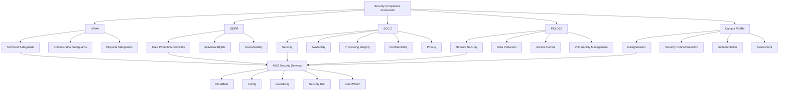
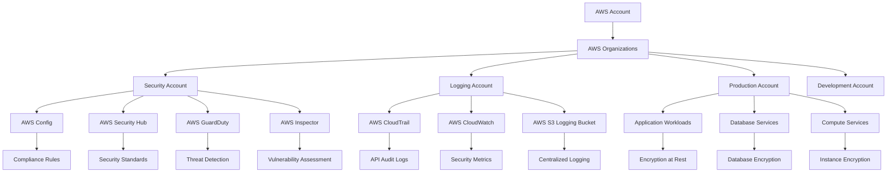
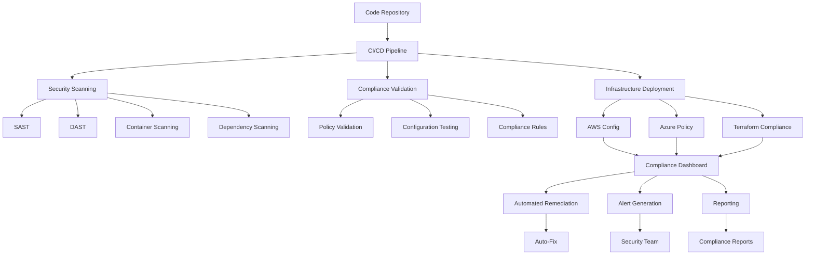
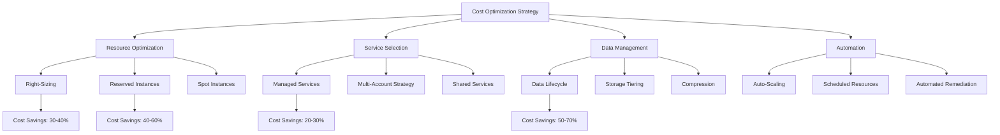
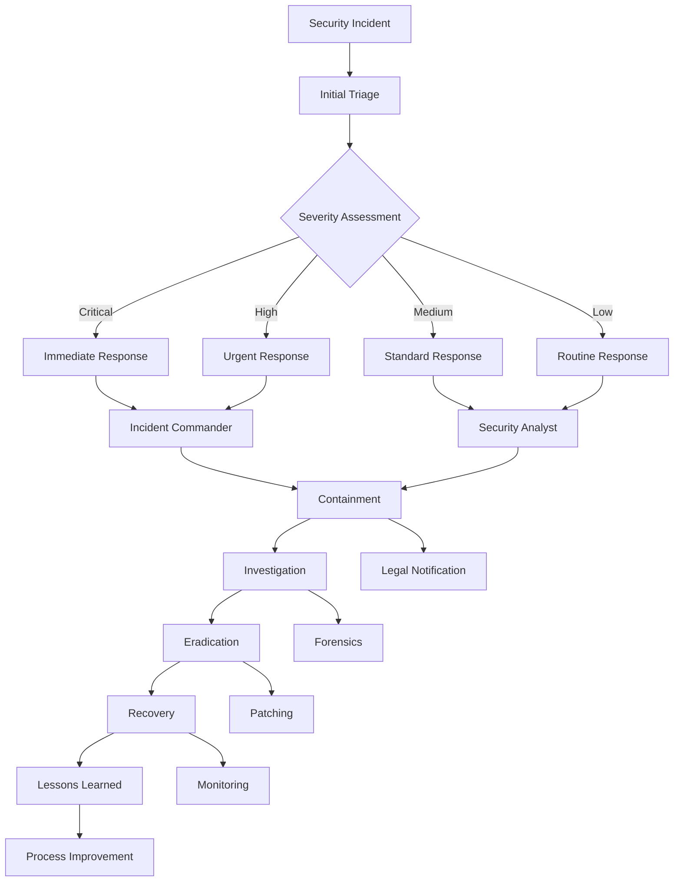

# Security Compliance and Cloud Adoption Guide

## Overview

This guide provides comprehensive security and compliance frameworks for cloud adoption, focusing on HIPAA, GDPR, SOC 2, PCI DSS, and Canada PBMM requirements while implementing robust encryption, logging, and policy enforcement across AWS and Azure environments.

### Compliance Architecture Overview



## HIPAA Compliance Framework

### Data Protection Requirements

#### Encryption Standards (§164.312(a)(2)(iv))

- **Data at Rest**: AES-256 encryption for all storage services
  - AWS: S3 Server-Side Encryption (SSE), EBS encryption, RDS encryption
  - Azure: Storage Service Encryption, Azure Disk Encryption, Transparent Data Encryption
- **Data in Transit**: TLS 1.3 minimum for all communications
  - API calls, database connections, and inter-service communication
  - VPN connections using IPSec with strong cipher suites
- **Key Management**: Hardware Security Modules (HSM) for key protection
  - AWS: CloudHSM Classic and CloudHSM
  - Azure: Key Vault Premium with HSM-protected keys

#### Access Control (§164.312(a)(1))

- **Unique User Identification**: Each user must have unique credentials
- **Emergency Access**: Break-glass procedures for emergency situations
- **Automatic Logoff**: Session timeouts and idle user logoff
- **Encryption and Decryption**: Role-based access to encryption keys

### Administrative Safeguards

#### Security Officer Designation (§164.308(a)(2))

- **Chief Information Security Officer (CISO)**: Overall security responsibility
- **Data Protection Officer (DPO)**: GDPR compliance oversight
- **Security Team Structure**: Dedicated security personnel with defined roles
- **Training Programs**: Regular security awareness and compliance training

#### Workforce Training (§164.308(a)(5))

- **Initial Training**: Comprehensive onboarding security education
- **Ongoing Education**: Regular updates on threats and compliance changes
- **Role-Specific Training**: Targeted training based on job responsibilities
- **Incident Response Training**: Hands-on exercises and tabletop drills

### Technical Safeguards

#### Audit Controls (§164.312(b))

- **Comprehensive Logging**: All system access and data modifications
- **Log Retention**: Minimum 6-year retention for HIPAA compliance
- **Real-time Monitoring**: Automated detection of suspicious activities
- **Forensic Capabilities**: Detailed investigation and evidence collection

#### Integrity Controls (§164.312(c)(1))

- **Data Validation**: Checksums and digital signatures for data integrity
- **Version Control**: Comprehensive change management and rollback capabilities
- **Backup Verification**: Regular backup integrity testing and validation
- **Tamper Detection**: Mechanisms to detect unauthorized data modifications

## GDPR Compliance Framework

### Data Protection Principles (Article 5)

#### Lawfulness, Fairness, and Transparency

- **Legal Basis Documentation**: Clear documentation of processing legal basis
- **Privacy Notices**: Comprehensive and accessible privacy statements
- **Consent Management**: Granular consent collection and management systems
- **Data Subject Rights**: Automated systems for rights fulfillment

#### Purpose Limitation and Data Minimization

- **Data Classification**: Comprehensive data inventory and classification
- **Processing Purpose**: Clear definition and documentation of processing purposes
- **Data Retention**: Automated retention policies and deletion procedures
- **Access Controls**: Principle of least privilege for data access

### Individual Rights (Chapter III)

#### Right to Access (Article 15)

- **Data Portability**: Automated export of personal data in machine-readable format
- **Response Timeline**: Automated workflows for 30-day response requirement
- **Identity Verification**: Secure identity verification before data disclosure
- **Third-Party Integration**: Coordination with processors for comprehensive responses

#### Right to Erasure (Article 17)

- **Automated Deletion**: Systems for complete data removal across all systems
- **Third-Party Notification**: Automated notification to data processors
- **Exception Handling**: Clear procedures for legitimate retention requirements
- **Audit Trails**: Comprehensive logging of erasure activities

### Data Protection by Design (Article 25)

- **Privacy-First Architecture**: Built-in privacy controls in system design
- **Default Settings**: Privacy-protective default configurations
- **Impact Assessments**: Regular Data Protection Impact Assessments (DPIAs)
- **Vendor Management**: Privacy-compliant vendor selection and monitoring

## Canada PBMM (Protected B, Medium Integrity, Medium Availability)

### Security Control Framework

#### Categorization and Risk Assessment

- **Information Classification**: Protected B classification for sensitive government data
- **Impact Analysis**: Assessment of confidentiality, integrity, and availability impacts
- **Risk Tolerance**: Medium-level risk tolerance with appropriate safeguards
- **Continuous Monitoring**: Ongoing assessment of security posture

#### Security Control Selection (ITSG-33)

- **Baseline Controls**: Implementation of PBMM baseline security controls
- **Control Enhancements**: Additional controls based on risk assessment
- **Compensating Controls**: Alternative controls when standard controls are not feasible
- **Tailoring**: Customization of controls to specific operational requirements

#### Implementation Requirements

- **Encryption**: AES-256 encryption for data at rest and in transit
- **Access Control**: Role-based access control with multi-factor authentication
- **Audit Logging**: Comprehensive logging of all security-relevant events
- **Incident Response**: Formal incident response procedures with government notification

### Technical Implementation

#### Data Residency and Sovereignty

- **Geographic Restrictions**: Data must remain within Canadian borders
- **Cloud Service Providers**: Use of authorized cloud service providers only
- **Data Backup**: Encrypted backups with geographic restrictions
- **Disaster Recovery**: Canadian-based disaster recovery capabilities

#### Network Security

- **Perimeter Protection**: Firewalls and intrusion detection systems
- **Network Segmentation**: Isolation of sensitive systems and data
- **Encryption**: End-to-end encryption for all network communications
- **Monitoring**: 24/7 network monitoring and threat detection

## SOC 2 (Service Organization Control 2)

### Trust Service Criteria

#### Security (CC)

- **Logical Access Controls**: User authentication and authorization
- **System Operations**: Secure system configuration and maintenance
- **Change Management**: Controlled changes to systems and processes
- **Risk Mitigation**: Identification and mitigation of security risks

#### Availability (A)

- **System Monitoring**: Continuous monitoring of system availability
- **Capacity Planning**: Proactive planning for system capacity
- **Backup and Recovery**: Comprehensive backup and disaster recovery procedures
- **Incident Response**: Rapid response to availability incidents

#### Processing Integrity (PI)

- **Data Validation**: Input validation and processing controls
- **Error Handling**: Proper error detection and correction procedures
- **Transaction Processing**: Secure and accurate transaction processing
- **Data Quality**: Mechanisms to ensure data accuracy and completeness

#### Confidentiality (C)

- **Data Classification**: Proper classification of confidential information
- **Access Controls**: Restricted access to confidential data
- **Encryption**: Protection of confidential data in transit and at rest
- **Secure Disposal**: Secure deletion of confidential information

#### Privacy (P)

- **Notice and Consent**: Clear privacy notices and consent mechanisms
- **Data Collection**: Limitation of data collection to specified purposes
- **Data Retention**: Appropriate retention and disposal of personal information
- **Individual Rights**: Support for individual privacy rights

## PCI DSS (Payment Card Industry Data Security Standard)

### Core Requirements

#### Build and Maintain Secure Networks

- **Firewall Configuration**: Proper firewall and router configuration
- **Security Parameters**: Changing vendor-supplied default passwords
- **Network Segmentation**: Isolation of cardholder data environment
- **Access Control**: Restrictions on access to cardholder data

#### Protect Cardholder Data

- **Data Protection**: Encryption of stored cardholder data
- **Transmission Security**: Encryption of cardholder data across networks
- **Data Retention**: Minimal retention of cardholder data
- **Secure Deletion**: Secure disposal of cardholder data

#### Maintain Vulnerability Management

- **Antivirus Software**: Use and regular updates of antivirus software
- **Secure Systems**: Development and maintenance of secure systems
- **Patch Management**: Regular application of security patches
- **Vulnerability Scanning**: Regular vulnerability assessments

#### Implement Strong Access Controls

- **Access Management**: Restriction of access to cardholder data
- **User Authentication**: Unique ID assignment and strong authentication
- **Physical Access**: Restriction of physical access to cardholder data
- **Remote Access**: Secure remote access procedures

#### Monitor and Test Networks

- **Security Monitoring**: Tracking and monitoring of network access
- **Security Testing**: Regular testing of security systems
- **Log Management**: Proper logging and log review procedures
- **Incident Response**: Formal incident response procedures

#### Maintain Information Security Policy

- **Security Policy**: Comprehensive information security policy
- **Security Awareness**: Regular security awareness training
- **Vendor Management**: Secure management of service providers
- **Incident Response**: Formal incident response and communication procedures

## AWS Security Implementation

### Compliance Architecture in AWS



### Identity and Access Management

#### AWS IAM Best Practices

- **Root Account Protection**: Strong authentication and minimal usage
- **Policy-Based Access**: Granular permissions using IAM policies
- **Role-Based Access Control**: Service roles and cross-account access
- **Multi-Factor Authentication**: MFA for all privileged accounts

#### AWS Organizations and Control Tower

- **Account Structure**: Segregation of environments and workloads
- **Service Control Policies**: Preventive guardrails across accounts
- **Centralized Logging**: CloudTrail organization trail configuration
- **Compliance Monitoring**: Config rules for continuous compliance validation

### Data Protection Services

#### AWS Key Management Service (KMS)

- **Customer Managed Keys**: Full control over key lifecycle and policies
- **Key Rotation**: Automatic annual key rotation for compliance
- **Cross-Region Replication**: Multi-region key availability for disaster recovery
- **Audit Integration**: CloudTrail logging of all key usage

#### AWS CloudHSM

- **Dedicated Hardware**: Single-tenant hardware security modules
- **FIPS 140-2 Level 3**: Certified hardware for highest security requirements
- **High Availability**: Multi-AZ deployment for fault tolerance
- **Application Integration**: Native integration with database and application encryption

### Monitoring and Compliance

#### AWS CloudTrail

- **API Logging**: Comprehensive logging of all AWS API calls
- **Data Events**: S3 and Lambda data-level operation logging
- **Log File Integrity**: Cryptographic verification of log files
- **Cross-Region Logging**: Centralized logging across all AWS regions

#### AWS Config

- **Configuration Monitoring**: Continuous monitoring of resource configurations
- **Compliance Rules**: Automated evaluation against compliance requirements
- **Remediation**: Automatic remediation of non-compliant resources
- **Change Management**: Detailed tracking of configuration changes

### AWS CLI Commands for Compliance Setup

#### Enable AWS Config

```bash
# Create S3 bucket for Config
aws s3 mb s3://my-config-bucket-$(date +%s) --region us-east-1

# Create Config delivery channel
aws configservice put-delivery-channel \
  --delivery-channel name=default,s3BucketName=my-config-bucket-$(date +%s)

# Create Config configuration recorder
aws configservice put-configuration-recorder \
  --configuration-recorder name=default,roleARN=arn:aws:iam::123456789012:role/aws-config-role,recordingGroup='{"allSupported":true,"includeGlobalResourceTypes":true}'

# Start Config recorder
aws configservice start-configuration-recorder --configuration-recorder-name default
```

#### Enable CloudTrail

```bash
# Create CloudTrail
aws cloudtrail create-trail \
  --name compliance-trail \
  --s3-bucket-name my-cloudtrail-bucket \
  --include-global-service-events \
  --is-multi-region-trail \
  --enable-log-file-validation

# Start logging
aws cloudtrail start-logging --name compliance-trail
```

#### Enable GuardDuty

```bash
# Enable GuardDuty
aws guardduty create-detector --enable

# Create threat intel set
aws guardduty create-threat-intel-set \
  --detector-id 12abc34d567e8f4912ab34c56de78f90 \
  --name "Custom-Threat-List" \
  --format TXT \
  --location s3://my-threat-intel-bucket/threatlist.txt \
  --activate
```

#### Enable Security Hub

```bash
# Enable Security Hub
aws securityhub enable-security-hub

# Enable AWS Config standard
aws securityhub batch-enable-standards \
  --standards-subscription-requests StandardsArn=arn:aws:securityhub:::ruleset/finding-format/aws-foundational-security-standard/v/1.0.0

# Enable CIS standard
aws securityhub batch-enable-standards \
  --standards-subscription-requests StandardsArn=arn:aws:securityhub:::ruleset/finding-format/cis-aws-foundations-benchmark/v/1.2.0
```

### CloudFormation Templates for Compliance Infrastructure

#### Compliance Monitoring Stack

```yaml
AWSTemplateFormatVersion: '2010-09-09'
Description: 'Compliance monitoring infrastructure with Config, CloudTrail, and GuardDuty'

Parameters:
  BucketName:
    Type: String
    Description: Name for the S3 bucket (must be globally unique)
    Default: compliance-logs

  NotificationEmail:
    Type: String
    Description: Email address for security notifications
    Default: security@company.com

Resources:
  # S3 Bucket for Config and CloudTrail
  ComplianceLogsBucket:
    Type: AWS::S3::Bucket
    Properties:
      BucketName: !Sub '${BucketName}-${AWS::AccountId}-${AWS::Region}'
      BucketEncryption:
        ServerSideEncryptionConfiguration:
          - ServerSideEncryptionByDefault:
              SSEAlgorithm: AES256
      PublicAccessBlockConfiguration:
        BlockPublicAcls: true
        BlockPublicPolicy: true
        IgnorePublicAcls: true
        RestrictPublicBuckets: true
      VersioningConfiguration:
        Status: Enabled
      LifecycleConfiguration:
        Rules:
          - Id: DeleteOldLogs
            Status: Enabled
            ExpirationInDays: 2555  # 7 years for compliance

  # IAM Role for Config
  ConfigRole:
    Type: AWS::IAM::Role
    Properties:
      AssumeRolePolicyDocument:
        Version: '2012-10-17'
        Statement:
          - Effect: Allow
            Principal:
              Service: config.amazonaws.com
            Action: sts:AssumeRole
      ManagedPolicyArns:
        - arn:aws:iam::aws:policy/service-role/ConfigRole
      Policies:
        - PolicyName: ConfigBucketAccess
          PolicyDocument:
            Version: '2012-10-17'
            Statement:
              - Effect: Allow
                Action:
                  - s3:GetBucketAcl
                  - s3:ListBucket
                Resource: !GetAtt ComplianceLogsBucket.Arn
              - Effect: Allow
                Action:
                  - s3:GetObject
                  - s3:PutObject
                Resource: !Sub '${ComplianceLogsBucket.Arn}/*'

  # Config Delivery Channel
  ConfigDeliveryChannel:
    Type: AWS::Config::DeliveryChannel
    Properties:
      Name: default
      S3BucketName: !Ref ComplianceLogsBucket

  # Config Configuration Recorder
  ConfigurationRecorder:
    Type: AWS::Config::ConfigurationRecorder
    Properties:
      Name: default
      RoleARN: !GetAtt ConfigRole.Arn
      RecordingGroup:
        AllSupported: true
        IncludeGlobalResourceTypes: true

  # CloudTrail
  ComplianceCloudTrail:
    Type: AWS::CloudTrail::Trail
    Properties:
      TrailName: compliance-trail
      S3BucketName: !Ref ComplianceLogsBucket
      S3KeyPrefix: cloudtrail/
      IncludeGlobalServiceEvents: true
      IsMultiRegionTrail: true
      EnableLogFileValidation: true
      EventSelectors:
        - ReadWriteType: All
          IncludeManagementEvents: true
          DataResources:
            - Type: AWS::S3::Object
              Values: ['arn:aws:s3:::*/*']

  # GuardDuty Detector
  GuardDutyDetector:
    Type: AWS::GuardDuty::Detector
    Properties:
      Enable: true
      FindingPublishingFrequency: FIFTEEN_MINUTES

  # Security Hub
  SecurityHub:
    Type: AWS::SecurityHub::Hub
    Properties:
      Tags:
        - Key: Purpose
          Value: Compliance

  # SNS Topic for Notifications
  SecurityNotificationTopic:
    Type: AWS::SNS::Topic
    Properties:
      TopicName: security-notifications
      Subscription:
        - Protocol: email
          Endpoint: !Ref NotificationEmail

  # CloudWatch Alarm for Config Compliance
  ConfigComplianceAlarm:
    Type: AWS::CloudWatch::Alarm
    Properties:
      AlarmName: Config-Compliance-Alarm
      AlarmDescription: Alarm for Config compliance violations
      MetricName: ComplianceByConfigRule
      Namespace: AWS/Config
      Statistic: Average
      Period: 300
      EvaluationPeriods: 1
      Threshold: 1
      ComparisonOperator: LessThanThreshold
      AlarmActions:
        - !Ref SecurityNotificationTopic

Outputs:
  ConfigBucket:
    Description: S3 bucket for Config and CloudTrail logs
    Value: !Ref ComplianceLogsBucket

  GuardDutyDetector:
    Description: GuardDuty detector ID
    Value: !Ref GuardDutyDetector

  SecurityHub:
    Description: Security Hub ARN
    Value: !Ref SecurityHub
```

#### Encryption and Key Management Stack

```yaml
AWSTemplateFormatVersion: '2010-09-09'
Description: 'KMS keys and encryption setup for compliance'

Parameters:
  KeyAdminRole:
    Type: String
    Description: ARN of the IAM role for key administration
    Default: arn:aws:iam::123456789012:role/KeyAdminRole

Resources:
  # Customer Managed KMS Key
  ComplianceKMSKey:
    Type: AWS::KMS::Key
    Properties:
      Description: Customer managed key for compliance encryption
      KeyPolicy:
        Version: '2012-10-17'
        Statement:
          - Sid: Enable IAM User Permissions
            Effect: Allow
            Principal:
              AWS: !Sub 'arn:aws:iam::${AWS::AccountId}:root'
            Action: 'kms:*'
            Resource: '*'
          - Sid: Allow use of the key
            Effect: Allow
            Principal:
              AWS: !Ref KeyAdminRole
            Action:
              - kms:Encrypt
              - kms:Decrypt
              - kms:ReEncrypt*
              - kms:GenerateDataKey*
              - kms:DescribeKey
            Resource: '*'
          - Sid: Allow attachment of persistent resources
            Effect: Allow
            Principal:
              AWS: !Ref KeyAdminRole
            Action:
              - kms:CreateGrant
              - kms:ListGrants
              - kms:RevokeGrant
            Resource: '*'
            Condition:
              Bool:
                kms:GrantIsForAWSResource: true
      KeyRotationEnabled: true

  # KMS Key Alias
  ComplianceKMSKeyAlias:
    Type: AWS::KMS::Alias
    Properties:
      AliasName: alias/compliance-key
      TargetKeyId: !Ref ComplianceKMSKey

Outputs:
  KMSKeyId:
    Description: KMS Key ID for compliance encryption
    Value: !Ref ComplianceKMSKey

  KMSKeyArn:
    Description: KMS Key ARN for compliance encryption
    Value: !GetAtt ComplianceKMSKey.Arn
```

## Azure Security Implementation

### Identity and Access Management

#### Azure Active Directory (AAD)

- **Conditional Access**: Policy-based access controls with risk assessment
- **Privileged Identity Management**: Just-in-time access for administrative roles
- **Identity Protection**: AI-powered risk detection and automated responses
- **Multi-Factor Authentication**: Comprehensive MFA across all access scenarios

#### Azure Role-Based Access Control (RBAC)

- **Built-in Roles**: Predefined roles for common scenarios
- **Custom Roles**: Granular permissions for specific business requirements
- **Management Groups**: Hierarchical access control across subscriptions
- **Access Reviews**: Regular review and certification of access permissions

### Data Protection Services

#### Azure Key Vault

- **Secrets Management**: Secure storage and access control for secrets
- **Key Management**: Hardware and software-protected key storage
- **Certificate Management**: Automated certificate lifecycle management
- **Audit Logging**: Comprehensive logging of all vault operations

#### Azure Information Protection

- **Data Classification**: Automated and manual data classification
- **Rights Management**: Document-level access control and encryption
- **Data Loss Prevention**: Policy-based prevention of data exfiltration
- **Usage Analytics**: Detailed reporting on protected content usage

### Monitoring and Compliance

#### Azure Monitor and Security Center

- **Security Posture**: Continuous assessment of security configuration
- **Threat Detection**: AI-powered threat detection and response
- **Compliance Dashboard**: Real-time compliance status across subscriptions
- **Security Recommendations**: Prioritized security improvement recommendations

#### Azure Sentinel

- **SIEM Capabilities**: Centralized security information and event management
- **Threat Intelligence**: Integration with global threat intelligence feeds
- **Automated Response**: Playbook-based automated incident response
- **Investigation Tools**: Advanced analytics for security incident investigation

## Automated Compliance Monitoring Setup

### Continuous Compliance Pipeline



### Implementation Components

#### Infrastructure as Code Compliance

```bash
# Terraform compliance validation
terraform plan -out=tfplan
terraform show -json tfplan | jq > tfplan.json

# Run compliance checks
terrascan scan -f tfplan.json
checkov -f tfplan.json --framework terraform

# AWS Config rule deployment
aws configservice put-config-rule \
  --config-rule '{
    "ConfigRuleName": "encrypted-volumes",
    "Description": "Checks whether EBS volumes are encrypted",
    "Source": {
      "Owner": "AWS",
      "SourceIdentifier": "ENCRYPTED_VOLUMES"
    },
    "Scope": {
      "ComplianceResourceTypes": ["AWS::EC2::Volume"]
    }
  }'
```

#### Automated Remediation Scripts

```python
# AWS Lambda function for automatic remediation
import boto3
import json

def lambda_handler(event, context):
    """Automatically remediate non-compliant resources"""

    config_client = boto3.client('config')
    ec2_client = boto3.client('ec2')

    # Parse Config rule evaluation
    config_item = event['configurationItem']
    resource_type = config_item['resourceType']
    resource_id = config_item['resourceId']

    if resource_type == 'AWS::EC2::SecurityGroup':
        # Remediate overly permissive security groups
        remediate_security_group(ec2_client, resource_id)
    elif resource_type == 'AWS::S3::Bucket':
        # Remediate unencrypted S3 buckets
        remediate_s3_bucket(resource_id)

    return {
        'statusCode': 200,
        'body': json.dumps('Remediation completed')
    }

def remediate_security_group(ec2_client, sg_id):
    """Remove overly permissive rules from security groups"""
    try:
        # Revoke 0.0.0.0/0 ingress rules
        ec2_client.revoke_security_group_ingress(
            GroupId=sg_id,
            IpPermissions=[
                {
                    'IpProtocol': '-1',
                    'IpRanges': [{'CidrIp': '0.0.0.0/0'}]
                }
            ]
        )
        print(f"Remediated security group {sg_id}")
    except Exception as e:
        print(f"Error remediating security group {sg_id}: {str(e)}")

def remediate_s3_bucket(bucket_name):
    """Enable encryption on S3 buckets"""
    s3_client = boto3.client('s3')

    try:
        s3_client.put_bucket_encryption(
            Bucket=bucket_name,
            ServerSideEncryptionConfiguration={
                'Rules': [
                    {
                        'ApplyServerSideEncryptionByDefault': {
                            'SSEAlgorithm': 'AES256'
                        }
                    }
                ]
            }
        )
        print(f"Enabled encryption on bucket {bucket_name}")
    except Exception as e:
        print(f"Error enabling encryption on bucket {bucket_name}: {str(e)}")
```

#### Compliance Monitoring Dashboard

```bash
# CloudWatch custom metrics for compliance
aws cloudwatch put-metric-data \
  --namespace "Security/Compliance" \
  --metric-data MetricName=ComplianceScore,Value=85.5,Unit=Percent

# Create compliance dashboard
aws cloudwatch put-dashboard \
  --dashboard-name "Compliance-Dashboard" \
  --dashboard-body '{
    "widgets": [
      {
        "type": "metric",
        "properties": {
          "metrics": [
            ["AWS/Config", "ComplianceByConfigRule"],
            ["Security/Compliance", "ComplianceScore"]
          ],
          "period": 300,
          "stat": "Average",
          "region": "us-east-1",
          "title": "Compliance Status"
        }
      }
    ]
  }'
```

## Cost Optimization for Compliance Infrastructure

### Cost-Effective Compliance Architecture



### Cost Optimization Strategies

#### 1. Log Management Optimization

```bash
# S3 lifecycle policy for log retention
aws s3api put-bucket-lifecycle-configuration \
  --bucket compliance-logs-bucket \
  --lifecycle-configuration '{
    "Rules": [
      {
        "ID": "LogRetentionPolicy",
        "Status": "Enabled",
        "Filter": {"Prefix": "cloudtrail/"},
        "Transitions": [
          {
            "Days": 30,
            "StorageClass": "STANDARD_IA"
          },
          {
            "Days": 90,
            "StorageClass": "GLACIER"
          },
          {
            "Days": 365,
            "StorageClass": "DEEP_ARCHIVE"
          }
        ],
        "Expiration": {
          "Days": 2555
        }
      }
    ]
  }'
```

#### 2. Reserved Capacity Planning

```bash
# Calculate optimal reserved instance recommendations
aws ce get-rightsizing-recommendation \
  --service "Amazon Elastic Compute Cloud - Compute" \
  --configuration RecommendationTarget=SAME_INSTANCE_FAMILY,BenefitsConsidered=ESTIMATED_MONTHLY_SAVINGS

# Purchase reserved instances for compliance workloads
aws ec2 purchase-reserved-instances-offering \
  --reserved-instances-offering-id 12345678-1234-1234-1234-123456789012 \
  --instance-count 2
```

#### 3. Automated Cost Monitoring

```python
# Cost monitoring Lambda function
import boto3
import json
from datetime import datetime, timedelta

def lambda_handler(event, context):
    """Monitor compliance infrastructure costs"""

    ce_client = boto3.client('ce')

    # Get cost for last 30 days
    end_date = datetime.now().strftime('%Y-%m-%d')
    start_date = (datetime.now() - timedelta(days=30)).strftime('%Y-%m-%d')

    response = ce_client.get_cost_and_usage(
        TimePeriod={
            'Start': start_date,
            'End': end_date
        },
        Granularity='MONTHLY',
        Metrics=['BlendedCost'],
        GroupBy=[
            {
                'Type': 'DIMENSION',
                'Key': 'SERVICE'
            }
        ],
        Filter={
            'Dimensions': {
                'Key': 'SERVICE',
                'Values': [
                    'Amazon CloudWatch',
                    'AWS CloudTrail',
                    'AWS Config',
                    'Amazon GuardDuty',
                    'AWS Security Hub'
                ]
            }
        }
    )

    # Calculate total compliance costs
    total_cost = 0
    for result in response['ResultsByTime']:
        for group in result['Groups']:
            cost = float(group['Metrics']['BlendedCost']['Amount'])
            total_cost += cost

    # Send alert if costs exceed threshold
    if total_cost > 1000:  # $1000 threshold
        send_cost_alert(total_cost)

    return {
        'statusCode': 200,
        'body': json.dumps(f'Compliance costs: ${total_cost:.2f}')
    }

def send_cost_alert(cost):
    """Send cost alert to SNS topic"""
    sns_client = boto3.client('sns')

    message = f"Compliance infrastructure costs have exceeded threshold: ${cost:.2f}"

    sns_client.publish(
        TopicArn='arn:aws:sns:us-east-1:123456789012:cost-alerts',
        Message=message,
        Subject='Compliance Cost Alert'
    )
```

### Cost Optimization Results

#### Expected Savings

- **Storage Costs**: 50-70% reduction through lifecycle policies
- **Compute Costs**: 30-60% reduction through reserved instances and right-sizing
- **Monitoring Costs**: 20-30% reduction through service consolidation
- **Overall Compliance Infrastructure**: 40-50% cost reduction

#### Monitoring and Reporting

```bash
# Generate cost report
aws ce get-cost-and-usage \
  --time-period Start=2024-01-01,End=2024-12-31 \
  --granularity MONTHLY \
  --metrics BlendedCost \
  --group-by Type=DIMENSION,Key=SERVICE \
  --filter file://compliance-services-filter.json
```

## Enhanced Incident Response Procedures

### Incident Classification and Response



### Incident Response Procedures

#### 1. Detection and Analysis

```bash
# Automated incident detection
aws logs filter-log-events \
  --log-group-name /aws/lambda/security-monitoring \
  --filter-pattern '[timestamp, request_id, "ERROR"]' \
  --start-time 1577836800000

# GuardDuty findings analysis
aws guardduty get-findings \
  --detector-id 12abc34d567e8f4912ab34c56de78f90 \
  --finding-ids finding-id-1 finding-id-2
```

#### 2. Containment and Eradication

```bash
# Isolate compromised instance
aws ec2 create-security-group \
  --group-name quarantine-sg \
  --description "Quarantine security group" \
  --vpc-id vpc-12345678

# Move instance to quarantine
aws ec2 modify-instance-attribute \
  --instance-id i-1234567890abcdef0 \
  --groups sg-quarantine

# Revoke compromised IAM user access
aws iam attach-user-policy \
  --user-name compromised-user \
  --policy-arn arn:aws:iam::aws:policy/AWSDenyAll
```

#### 3. Recovery and Post-Incident

```bash
# Restore from backup
aws ec2 create-image \
  --instance-id i-1234567890abcdef0 \
  --name "clean-backup-$(date +%Y%m%d)"

# Update security groups
aws ec2 authorize-security-group-ingress \
  --group-id sg-12345678 \
  --protocol tcp \
  --port 443 \
  --cidr 10.0.0.0/8
```

### Compliance Breach Notification

#### Automated Notification System

```python
# Compliance breach notification
import boto3
import json
from datetime import datetime

def lambda_handler(event, context):
    """Handle compliance breach notifications"""

    breach_details = event['breach']
    regulation = breach_details['regulation']
    severity = breach_details['severity']

    # Determine notification requirements
    if regulation == 'GDPR':
        notify_gdpr_breach(breach_details)
    elif regulation == 'HIPAA':
        notify_hipaa_breach(breach_details)
    elif regulation == 'PCI_DSS':
        notify_pci_breach(breach_details)

    return {
        'statusCode': 200,
        'body': json.dumps('Breach notification sent')
    }

def notify_gdpr_breach(breach_details):
    """GDPR breach notification (72-hour requirement)"""
    sns_client = boto3.client('sns')

    message = {
        'breach_type': 'GDPR Data Breach',
        'notification_deadline': '72 hours',
        'details': breach_details,
        'required_actions': [
            'Notify supervisory authority',
            'Document breach details',
            'Assess need for individual notification'
        ]
    }

    sns_client.publish(
        TopicArn='arn:aws:sns:us-east-1:123456789012:gdpr-breach-notifications',
        Message=json.dumps(message),
        Subject='GDPR Breach Notification Required'
    )

def notify_hipaa_breach(breach_details):
    """HIPAA breach notification (60-day requirement)"""
    sns_client = boto3.client('sns')

    message = {
        'breach_type': 'HIPAA Security Incident',
        'notification_deadline': '60 days',
        'details': breach_details,
        'required_actions': [
            'Notify HHS within 60 days',
            'Individual notification if required',
            'Document incident response'
        ]
    }

    sns_client.publish(
        TopicArn='arn:aws:sns:us-east-1:123456789012:hipaa-breach-notifications',
        Message=json.dumps(message),
        Subject='HIPAA Breach Assessment Required'
    )
```

## Policy Enforcement Framework

### Automated Compliance Monitoring

#### Infrastructure as Code (IaC)

- **Terraform**: Multi-cloud infrastructure provisioning with security controls
- **ARM Templates**: Azure-native infrastructure deployment with governance
- **CloudFormation**: AWS-native infrastructure with security best practices
- **Policy as Code**: Version-controlled security and compliance policies

#### Continuous Compliance

- **CI/CD Integration**: Security and compliance checks in deployment pipelines
- **Drift Detection**: Automated detection and remediation of configuration drift
- **Compliance Reporting**: Automated generation of compliance reports
- **Exception Management**: Controlled processes for compliance exceptions

### Security Operations

#### Incident Response

- **Response Team**: Dedicated security incident response team with defined roles
- **Playbooks**: Documented procedures for common security incidents
- **Communication Plans**: Clear communication protocols for stakeholders
- **Lessons Learned**: Post-incident analysis and process improvement

#### Vulnerability Management

- **Scanning**: Regular vulnerability scanning of infrastructure and applications
- **Patch Management**: Automated patching with testing and rollback procedures
- **Risk Assessment**: Prioritization of vulnerabilities based on business impact
- **Remediation Tracking**: Comprehensive tracking of vulnerability remediation

## Compliance Validation and Reporting

### Audit Preparation

- **Documentation**: Comprehensive documentation of security controls
- **Evidence Collection**: Automated collection of compliance evidence
- **Control Testing**: Regular testing of security control effectiveness
- **Gap Analysis**: Identification and remediation of compliance gaps

### Regulatory Reporting

- **HIPAA**: Regular risk assessments and security evaluations
- **GDPR**: Data processing records and impact assessments
- **SOC 2**: Service organization control reports and attestations
- **ISO 27001**: Information security management system documentation

### Third-Party Assessments

- **Penetration Testing**: Regular external security assessments
- **Compliance Audits**: Independent validation of compliance programs
- **Vendor Assessments**: Security evaluation of third-party vendors
- **Certification Maintenance**: Ongoing activities to maintain security certifications

---

**Document Metadata:**

- **Scenario**: security-compliance
- **Cloud**: aws, azure, multi-cloud
- **Tags**: hipaa, gdpr, pci-dss, soc2, pbmm, encryption, logging, monitoring
- **Last Updated**: 2024-12-15
- **Version**: 2.0
- **Author**: AI SA Assistant
- **Review Date**: 2025-03-15
